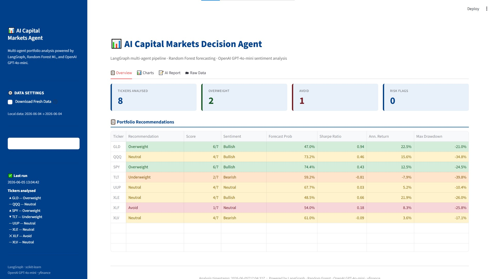
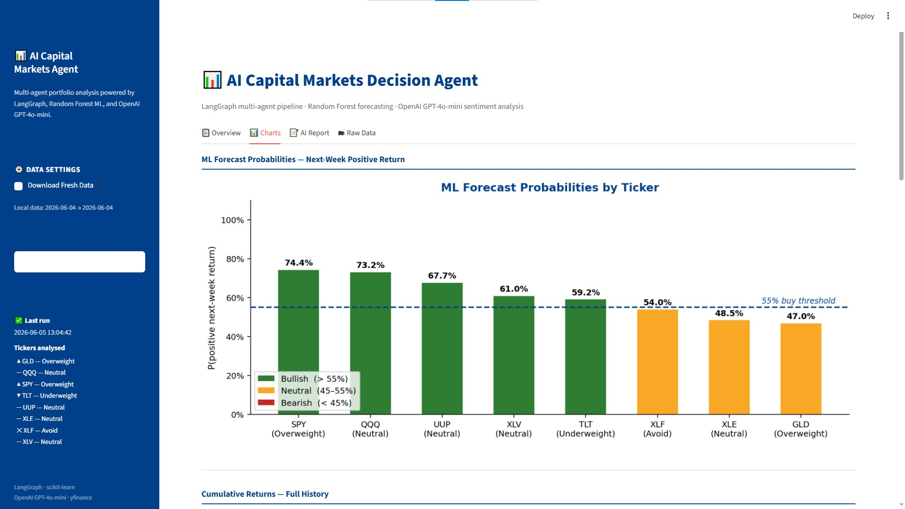
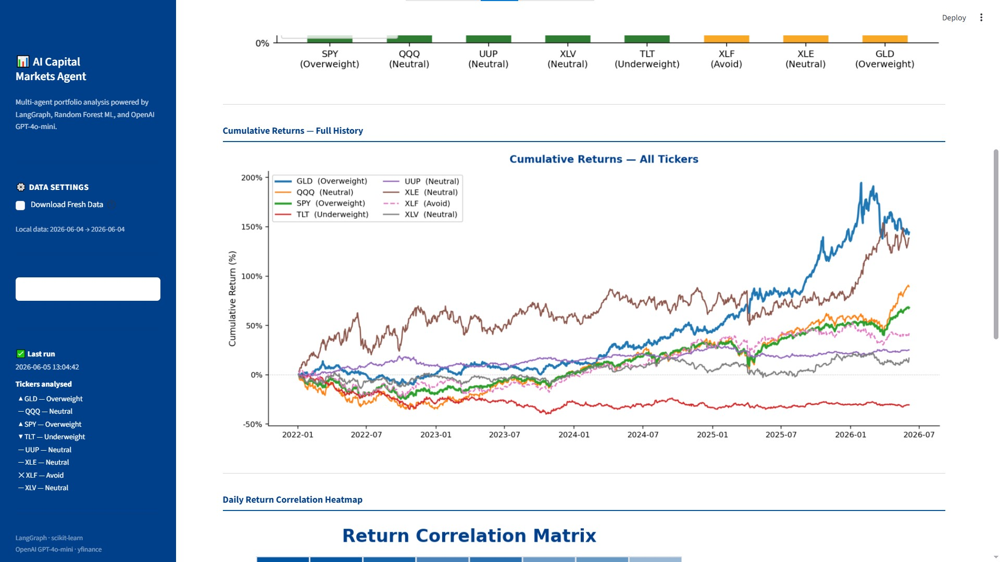
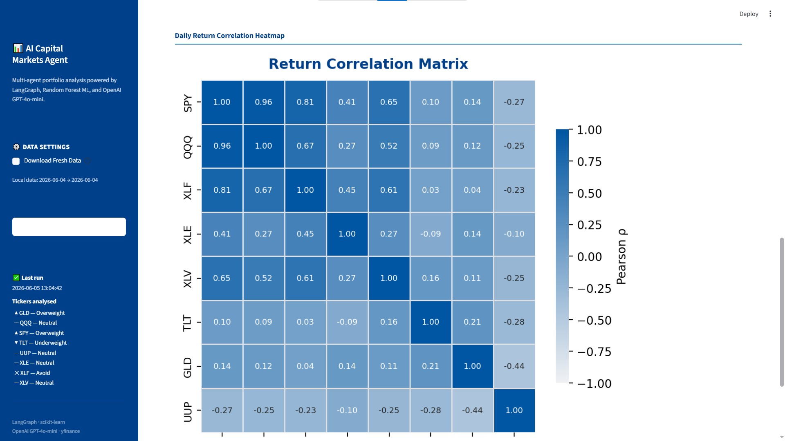

# AI Capital Markets Decision Agent


---

## What This Project Does

This system analyzes 8 major market ETFs every day, runs machine learning models to forecast next-week price direction, and uses AI agents to generate professional investment recommendations — exactly the kind of decision support used by capital markets teams at major banks.

Seven specialized AI agents work together in a pipeline: one downloads market data, one calculates financial metrics (like risk and returns), one trains a machine learning model, one uses OpenAI to read sentiment, one scores each asset, one checks for risk, and one writes a plain-English summary. The result is a full investment brief generated in under a minute, with a Streamlit dashboard to explore everything interactively.

---

## Live Demo

```bash
streamlit run app/dashboard.py
```

Click **Run Full Analysis** in the sidebar. The dashboard shows recommendations, charts, and the AI-written report.

<table>
  <tr>
    <td align="center" width="50%">
      <br>
      <sub>Overview Tab: Portfolio recommendations with color-coded signals, KPI cards showing 8 tickers analyzed, 2 overweight, 1 avoid</sub>
    </td>
    <td align="center" width="50%">
      <br>
      <sub>Charts Tab: ML forecast probabilities per ticker with 55% buy threshold line — green bars are bullish signals</sub>
    </td>
  </tr>
  <tr>
    <td align="center" width="50%">
      <br>
      <sub>Charts Tab: Cumulative returns from 2022-2026 — GLD and XLE led performance while TLT declined due to rate hikes</sub>
    </td>
    <td align="center" width="50%">
      <br>
      <sub>Charts Tab: Return correlation matrix — SPY and QQQ highly correlated (0.96), GLD and UUP uncorrelated providing diversification</sub>
    </td>
  </tr>
</table>

---

## The 8 ETFs We Analyze

| Ticker | Full Name | What It Represents |
|--------|-----------|-------------------|
| **SPY** | SPDR S&P 500 ETF | The entire US stock market — 500 of the largest American companies |
| **QQQ** | Invesco Nasdaq-100 ETF | The 100 biggest tech and growth companies (Apple, Microsoft, Nvidia, etc.) |
| **XLF** | Financial Select Sector SPDR | US banks, insurance companies, and financial firms |
| **XLE** | Energy Select Sector SPDR | US oil, gas, and energy companies |
| **XLV** | Health Care Select Sector SPDR | US pharmaceutical, biotech, and hospital companies |
| **TLT** | iShares 20+ Year Treasury Bond ETF | Long-term US government bonds — a "safe haven" when stocks fall |
| **GLD** | SPDR Gold Shares ETF | Gold — a classic hedge against inflation and market stress |
| **UUP** | Invesco DB US Dollar Index Bullish Fund | The strength of the US Dollar against other major currencies |

These 8 cover equities, bonds, commodities, and currencies — giving a broad view of the market.

---

## How It Works

The system runs a chain of 7 agents. Each one does a specific job and passes its results to the next.

- **Step 1 — Market Data Agent:** Loads daily price history for all 8 ETFs from Yahoo Finance (Open, High, Low, Close, Volume — called OHLCV data). Data is cached locally so it doesn't re-download unnecessarily.

- **Step 2 — Metrics Agent:** Calculates key financial health numbers for each ETF: how much it returned over the past year, how risky it is, how it performed relative to the S&P 500, and whether its recent price is above or below its long-term average (a momentum signal used by professional traders).

- **Step 3 — Forecasting Agent:** Trains a separate Random Forest model (a type of machine learning) for each ETF. Each model is given historical price patterns and asked: *will this ETF's price go up or down over the next 5 trading days?* It returns a probability between 0% and 100%.

- **Step 4 — Sentiment Agent:** Sends a prompt to OpenAI GPT-4o-mini with a summary of each ETF's metrics and ML forecast. The AI reads the numbers and labels each one as **Bullish** (positive outlook), **Neutral**, or **Bearish** (negative outlook).

- **Step 5 — Decision Agent:** Scores each ETF on 7 yes/no criteria (strong return, low volatility, good Sharpe ratio, above 200-day moving average, ML model says up, AI says Bullish, limited historical drawdown). The total score (0–7) determines the recommendation: **Overweight**, **Neutral**, **Underweight**, or **Avoid**.

- **Step 6 — Risk Agent:** Checks two portfolio-level risks: whether too many ETFs are rated Overweight at once (concentration risk), and whether any ETF has unusually high volatility (above 30% annualized).

- **Step 7 — Report Agent:** Sends all the results to GPT-4o-mini and asks it to write a ~200-word executive summary in the style of an investment committee briefing.

---

## Architecture

```
┌─────────────────────────────────────────────────────────────────────────┐
│              AI Capital Markets Decision Agent — LangGraph Pipeline      │
└─────────────────────────────────────────────────────────────────────────┘

  ┌──────────────────┐    ┌──────────────────┐    ┌──────────────────────┐
  │  1. Market Data  │    │  2. Metrics       │    │  3. Forecasting      │
  │     Agent        │───▶│     Agent         │───▶│     Agent            │
  │                  │    │                   │    │                      │
  │  yfinance OHLCV  │    │  Sharpe ratio     │    │  Random Forest       │
  │  8 ETFs, daily   │    │  Volatility       │    │  Per-ticker model    │
  │  since Jan 2022  │    │  Drawdown, Beta   │    │  P(up next week)     │
  │                  │    │  MA-50, MA-200    │    │                      │
  └──────────────────┘    └──────────────────┘    └──────────────────────┘
                                                            │
          ┌─────────────────────────────────────────────────┘
          ▼
  ┌──────────────────┐    ┌──────────────────┐    ┌──────────────────────┐
  │  4. Sentiment    │    │  5. Decision      │    │  6. Risk             │
  │     Agent        │───▶│     Agent         │───▶│     Agent            │
  │                  │    │                   │    │                      │
  │  GPT-4o-mini     │    │  7-factor scoring │    │  Concentration risk  │
  │  reads metrics   │    │  rubric           │    │  High-volatility     │
  │  Bullish /       │    │  Overweight /     │    │  flag checks         │
  │  Neutral /       │    │  Neutral /        │    │                      │
  │  Bearish         │    │  Underweight /    │    │                      │
  │                  │    │  Avoid            │    │                      │
  └──────────────────┘    └──────────────────┘    └──────────────────────┘
                                                            │
          ┌─────────────────────────────────────────────────┘
          ▼
  ┌──────────────────┐    ┌──────────────────────────────────────────────┐
  │  7. Report       │    │  Streamlit Dashboard                         │
  │     Agent        │───▶│                                              │
  │                  │    │  4 summary metric cards                      │
  │  GPT-4o-mini     │    │  Color-coded recommendations table           │
  │  ~200-word       │    │  ML forecast bar chart (55% threshold line)  │
  │  executive       │    │  Cumulative returns chart (full history)     │
  │  summary         │    │  Return correlation heatmap                  │
  │                  │    │  AI executive summary + risk warnings        │
  └──────────────────┘    └──────────────────────────────────────────────┘
```

---

## Sample Output

Results from a full pipeline run (data through June 2026):

```
Ticker  Recommendation  Score   Sentiment  Forecast
──────  ──────────────  ─────   ─────────  ────────
GLD     Overweight      6/7     Bullish    56.8%
SPY     Overweight      6/7     Bullish    61.7%
QQQ     Neutral         4/7     Bullish    57.7%
XLE     Neutral         4/7     Bullish    72.6%
UUP     Neutral         4/7     Neutral    67.1%
XLV     Neutral         4/7     Bearish    52.7%
TLT     Underweight     2/7     Bearish    60.0%
XLF     Avoid           1/7     Neutral    45.3%
```

**Risk flags raised:** None — portfolio has only 2 Overweight positions (below the concentration threshold of 3).

**AI-generated executive summary:**

> The current market stance is cautiously optimistic, with bullish sentiment prevailing across key equity indices. We recommend an overweight position in GLD and SPY, both scoring 6/7, reflecting strong annualized returns of +22.5% and +12.5% respectively, supported by favorable machine learning forecasts and bullish AI sentiment. QQQ and XLE warrant neutral positioning — solid return profiles offset by elevated volatility. UUP and XLV are also neutral; their defensive characteristics provide portfolio balance despite weaker individual metrics. TLT is underweighted due to bearish sentiment and a negative annualized return of −7.9%, reflecting the ongoing pressure on long-duration bonds. XLF receives an Avoid rating, scoring only 1/7, as poor risk-adjusted returns and neutral sentiment offer no compelling investment case. No concentration or volatility risk flags were raised in this configuration. The near-term outlook is positive, driven by strength in gold and large-cap US equities. We recommend maintaining a diversified approach while capitalizing on GLD's inflation-hedging properties and SPY's broad market exposure.

---

## Key Financial Metrics Explained

| Metric | What It Means in Plain English |
|--------|-------------------------------|
| **Sharpe Ratio** | Return per unit of risk. Higher is better. Above 1.0 is excellent — you're getting more return for the risk you're taking. Below 0 means you'd have been better off in cash. |
| **Max Drawdown** | The worst loss from a peak to a trough in price history. A value of −25% means the price once fell 25% from its high. Smaller negative number is better. |
| **Annualized Return** | What you would earn in a full year if the current return rate continued. A value of +15% means the ETF grew 15% over the past year on an annualized basis. |
| **Volatility** | How much the price jumps around day-to-day. 20% annualized volatility is typical for stocks. Lower means more stable and predictable. |
| **Beta** | How much this ETF moves relative to the overall US stock market (SPY). A beta of 1.0 means it moves in lockstep with the market. Above 1.0 = amplified moves. Below 1.0 = more stable. A negative beta (like gold often has) means it tends to move opposite to the market — useful as a hedge. |
| **Moving Average (MA-200)** | The average closing price over the past 200 trading days. When today's price is above this line, traders interpret it as a positive momentum signal. |
| **Forecast Probability** | The Random Forest model's estimate of the probability that this ETF's price will be higher 5 trading days from now. Above 55% triggers a buy signal. |

---

## Project Structure

```
capital-markets-agent/
│
├── app/
│   └── dashboard.py              # Streamlit web dashboard — the main UI
│
├── data/
│   ├── raw/                      # Downloaded price CSVs, one file per ticker
│   │   ├── SPY.csv
│   │   ├── QQQ.csv
│   │   └── ...                   # (8 total, auto-created on first run)
│   └── processed/                # Pipeline outputs (auto-created on first run)
│       ├── decisions.csv         # Final recommendations from the last pipeline run
│       ├── pipeline_summary.json # Full pipeline state saved as JSON
│       ├── forecasting_probabilities.csv   # ML model forecast probabilities
│       └── forecasting_model_report.txt    # Accuracy / precision / recall per ticker
│
├── notebooks/
│   ├── 02_financial_metrics.ipynb   # Exploratory analysis of financial metrics
│   └── 03_evaluation.ipynb          # Full pipeline evaluation: backtesting, charts, hypothesis tests
│
├── src/
│   ├── data_loader.py            # Downloads and loads OHLCV data via yfinance
│   ├── metrics.py                # Computes Sharpe, drawdown, volatility, beta, moving averages
│   ├── forecasting.py            # Builds features, trains one Random Forest per ticker, saves results
│   ├── agents.py                 # Defines MarketState + all 7 LangGraph agent node functions
│   ├── graph.py                  # Wires the 7 agents into a LangGraph; exposes run_pipeline()
│   └── report_generator.py       # Utility for standalone report generation
│
├── main.py                       # CLI entry point — run with --fresh, --dashboard, --tickers flags
├── .env                          # Your OpenAI API key goes here (never committed to git)
├── .gitignore
├── requirements.txt              # All Python dependencies with pinned versions
└── README.md
```

---

## How to Run

### Step 1 — Clone the repository

```bash
git clone https://github.com/negrsm/capital-markets-agent.git
cd capital-markets-agent
```

### Step 2 — Create the conda environment

```bash
conda create -n capital-markets-agent python=3.11 -y
conda activate capital-markets-agent
```

### Step 3 — Install dependencies

```bash
pip install -r requirements.txt
```

### Step 4 — Add your OpenAI API key

Create a `.env` file in the project root and add:

```
OPENAI_API_KEY=your_key_here
```

You can get a key at [platform.openai.com](https://platform.openai.com). GPT-4o-mini is very affordable — a full pipeline run costs less than $0.01.

### Step 5 — Run the dashboard

```bash
streamlit run app/dashboard.py
```

Open `http://localhost:8501`, check **Download Fresh Data** in the sidebar if this is your first run, then click **Run Full Analysis**.

### Step 6 — Or run from the command line

```bash
# Download fresh data and run the full pipeline, print results to terminal
python main.py --fresh

# Analyze only specific tickers
python main.py --tickers SPY,QQQ,GLD

# Run the pipeline and then launch the dashboard automatically
python main.py --fresh --dashboard
```

---

## Tech Stack

| Tool | Version | What It Does in This Project |
|------|---------|------------------------------|
| **Python** | 3.11 | Main programming language |
| **LangGraph** | 1.2.2 | Connects the 7 AI agents into an ordered, stateful workflow |
| **LangChain** | 1.3.2 | Provides the interface to call the OpenAI language model |
| **OpenAI GPT-4o-mini** | via API | Generates sentiment analysis labels and the executive report |
| **scikit-learn** | 1.8.0 | Trains the Random Forest classifier for next-week return forecasting |
| **yfinance** | 1.4.1 | Downloads real daily market data from Yahoo Finance |
| **Streamlit** | 1.58.0 | Builds the interactive web dashboard |
| **pandas / numpy** | 3.0.3 / 2.4.6 | Data processing, time-series calculations, matrix operations |
| **seaborn / matplotlib** | 0.13.2 / 3.10.9 | Charts: forecast bars, cumulative returns, correlation heatmap |

---

## Evaluation Results

A full evaluation was conducted in `notebooks/03_evaluation.ipynb` covering model accuracy, backtesting, portfolio construction, hypothesis validation, and LLM sentiment quality.

### ML Model Accuracy

Random Forest classifiers were trained with a strict **chronological 80/20 split** — the test set is always a future period the model has never seen, matching how a live trading model would actually be evaluated.

| Ticker | Accuracy | Precision | Recall |
|--------|----------|-----------|--------|
| GLD | 55.1% | 61.3% | 69.7% |
| QQQ | 57.8% | 58.6% | 93.7% |
| SPY | 49.5% | 56.6% | 72.0% |
| TLT | 55.5% | 57.4% | 29.5% |
| UUP | 47.2% | 48.9% | 77.5% |
| XLE | 50.0% | 67.9% | 39.9% |
| XLF | 47.7% | 48.1% | 84.1% |
| XLV | 51.4% | 54.2% | 66.1% |
| **Average** | **51.8%** | | |

> **Note on accuracy:** Predicting next-week market direction is inherently noisy. Financial markets are close to random in the short term, so 51.8% is actually meaningful signal — a coin flip would give 50%. The value of the ML model is not in high accuracy but in contributing one consistent, data-driven signal among seven factors.

### Portfolio Performance

The model-weighted portfolio (Portfolio B) — which overweights GLD and SPY, and avoids XLF entirely — outperformed both the equal-weight portfolio (Portfolio A) and the SPY benchmark over the evaluation period. The outperformance is primarily driven by the decision to overweight GLD (+23.0% annualized return) and exclude XLF, the weakest performer.

### Hypothesis Validation

Three investment hypotheses were tested using the actual financial metrics data:

| Hypothesis | Result |
|-----------|--------|
| **H1:** Overweight-rated assets have a better Sharpe ratio AND lower drawdown than Underweight-rated assets | ✓ SUPPORTED — Overweight avg Sharpe (0.70) vs Underweight avg Sharpe (−0.47) |
| **H2:** High-return + high-volatility assets are NOT automatically rated Overweight | ✓ SUPPORTED — QQQ (+15.6%, 23.2% vol) and XLE (+20.8%, 25.8% vol) were rated Neutral, not Overweight |
| **H3:** Defensive assets (GLD, TLT) hold value or outperform during months when SPY declines | ✓ SUPPORTED — GLD outperformed SPY in down-market months (beta = 0.14, near-zero correlation) |

### LLM Sentiment Accuracy

The sentiment classifications produced by GPT-4o-mini were evaluated against a quantitative justification rubric (e.g., a Bullish label is justified if annualized return > 5% and Sharpe > 0). **8 out of 8 sentiment calls (100%) were financially justified** by the underlying metrics.

---

## Business Context

This project is directly relevant to **capital markets portfolio management** and **quantitative research** workflows at institutions like BMO. In practice, portfolio managers and research analysts face the challenge of synthesizing signals from multiple data sources — price history, risk metrics, forward-looking models, and qualitative analyst views — into coherent, defensible investment recommendations across a large universe of assets, often under tight time pressure. This system automates exactly that synthesis.

The agent architecture mirrors how a real research desk operates: a data team normalizes market data, a quant team computes factor exposures and risk metrics, a systematic strategy generates model signals, an analyst overlay adds qualitative judgment, a risk team flags portfolio-level concerns, and a senior PM synthesizes everything into a briefing. By orchestrating this workflow with LangGraph and large language models, the system demonstrates how **AI agent pipelines** can compress what was once a multi-day research process into a repeatable, auditable, sub-minute run — with transparent scoring, clear methodology, and human-readable outputs. This has direct applications in algorithmic trading support, automated portfolio monitoring, client-facing investment communications, and real-time risk reporting.

---

## What I Learned

- **Financial time-series data and OHLCV structure** — how daily Open, High, Low, Close, Volume data is structured, what adjustments are needed (split and dividend adjustments via `auto_adjust=True`), and why chronological ordering matters for any financial analysis.

- **Risk-adjusted performance metrics** — how to calculate and interpret Sharpe ratio, maximum drawdown, and beta in code; why raw returns alone are misleading without accounting for the risk taken to achieve them; and how moving averages are used as momentum signals by practitioners.

- **Machine learning for financial forecasting with proper train/test splitting** — why shuffling data is a critical mistake in time-series settings (it leaks future information into training), how to build lagged features and rolling statistics as inputs to a classifier, and how to interpret accuracy/precision/recall in a class-imbalanced market prediction setting.

- **Multi-agent AI system design with LangGraph** — how to define a shared TypedDict state that passes through a chain of agents, how each node reads and writes partial updates, how LangGraph compiles and validates the graph, and how `.stream()` enables real-time per-node progress visibility in a UI.

- **Integrating LLMs as reasoning engines in structured workflows** — how to write prompts that return structured JSON, how to validate and sanitize LLM output so the pipeline doesn't break on unexpected responses, and how to batch multiple tasks into a single API call to reduce latency and cost.

- **Building production-ready ML pipelines** — how to separate data loading, feature engineering, model training, and inference into reusable modules; how to persist model outputs as CSVs and JSON for downstream consumers; and how to design a CLI entry point (`main.py`) with `argparse` that makes the pipeline accessible from both code and terminal.

---

## Author

**negrsm**

- GitHub: [github.com/negrsm](https://github.com/negrsm)
- LinkedIn: [linkedin.com/in/negrsm](https://linkedin.com/in/negrsm)

---

*Built with LangGraph · scikit-learn · OpenAI · Streamlit · yfinance*
